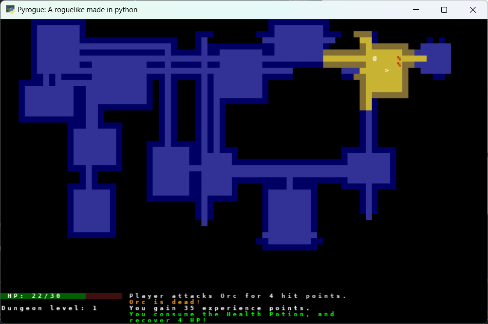
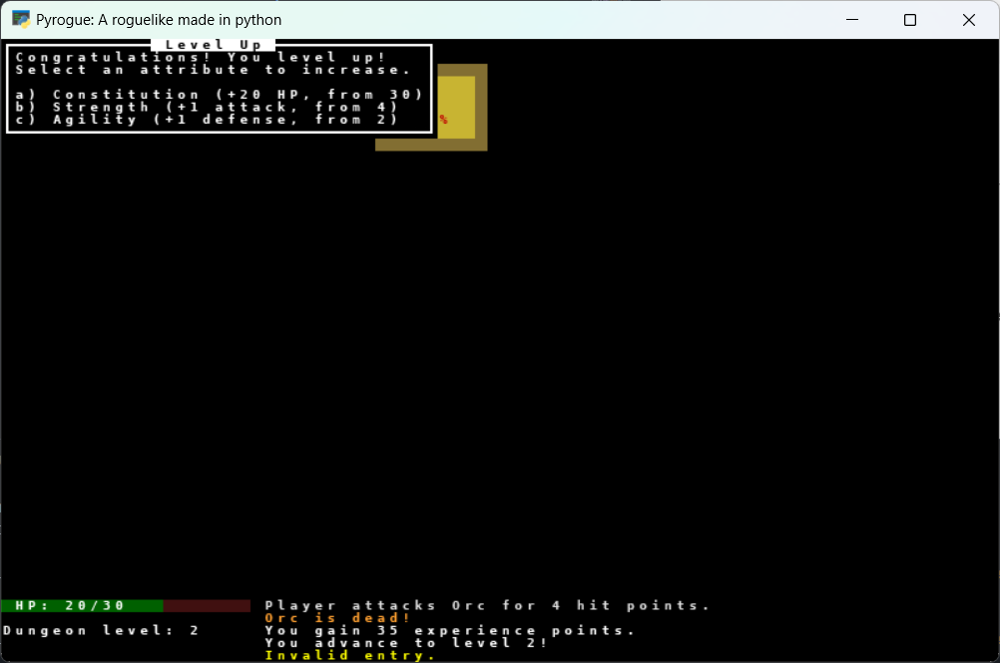
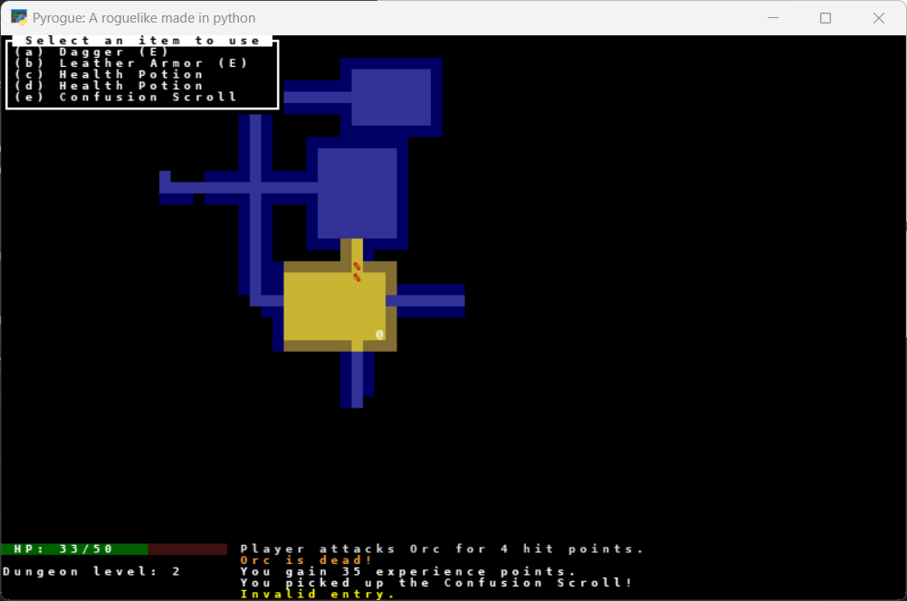

# TCOD Roguelike

A simple roguelike game built using [libtcod](https://github.com/libtcod/libtcod) in Python. This game features procedurally generated dungeon levels, turn-based combat, and inventory management.

## Features

- Procedural dungeon generation
- Turn-based combat system
- Inventory and item usage
- Field of view and lighting system
- Basic enemy AI
- **Automatic saving on exit**
- **Game file deletion upon death**

## Installation

Ensure you have Python installed, then clone the repository and install the required dependencies:

```sh
# Clone the repository
git clone https://github.com/KonyD/tcod-roguelike.git
cd tcod-roguelike

# Install dependencies
pip install -r requirements.txt
```

## Running the Game

Run the following command to start the game:

```sh
python main.py
```

## Controls

- **Arrow Keys / WASD** - Move the player
- **G** - Pick up an item
- **D** - Drop an item
- **I** - Open inventory
- **[Item Key]** - Use an item (press the character next to your item)
- **V** - Open message history
- **Escape** - Exit game

## Screenshots





## Roadmap

Planned features for future updates:

- [x] Sound effects
- [ ] Improved settings
- [ ] More enemies and items

## License

This project is licensed under the MIT License. See the `LICENSE` file for details.

## Contributing

Feel free to submit issues or pull requests if you'd like to contribute!

---

Happy dungeon crawling! 🏰⚔️
